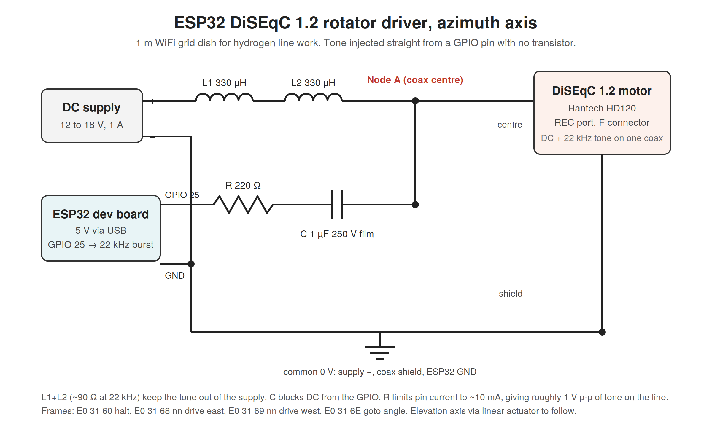

# DiSEqC dish rotator

An ESP32 that turns a $50 satellite dish motor (any DiSEqC 1.2 H-H motor) into a
software controlled azimuth rotator for a small radio telescope dish. Built for a
1 m grid dish used for hydrogen line observing. Four passive parts, no driver IC,
no set top box.

Author: Ayushman Tripathi, https://radioastronomy.in
License: MIT. Use it, change it, share it.

## How it works

DiSEqC motors take power and commands over the same coax: 12 to 18 V DC plus a
22 kHz tone burst that carries the command bytes. This board feeds the DC in
through two inductors and couples the tone straight from an ESP32 GPIO pin
through a resistor and a capacitor. The ESP32 generates the DiSEqC 1.2 frames
(halt, drive east, drive west, goto angle) and exposes them over USB serial and
over WiFi as a small web page and a plain HTTP API.



## Hardware

| Part | Value | Notes |
|---|---|---|
| Motor | DiSEqC 1.2 H-H satellite motor | Hantech HD120 used here, any brand works |
| MCU | ESP32 dev board (WROOM-32) | |
| L1, L2 | 330 uH toroidal, 5 A | in series between supply + and coax centre |
| C | 1 uF 250 V film | between resistor and coax centre |
| R | 100 ohm 1/4 W | between GPIO 25 and C |
| Supply | 12 to 18 V DC, 1 A | 12 V works, 15 to 18 V is better under load |
| Coax | RG6 with F connector | to the motor's REC port |

Full parts list with prices in [hardware/bom.md](hardware/bom.md).

### Wiring

```
Supply +  --- L1 --- L2 ---+--- coax centre --- motor REC port
                           |
GPIO 25 --- 100R --- 1uF --+

Supply -, coax shield, ESP32 GND all tied together
```

Screw terminal layout used on the prototype (nine screws, three 3-pin blocks):

```
1: supply +, L1        4: cap, resistor        7: supply -, shield, link
2: L1, L2              5: resistor, GPIO 25    8: link, ESP32 GND
3: L2, cap, coax ctr   6: empty                9: empty
```

## Firmware

`firmware/diseqc_rotator/diseqc_rotator.ino`, Arduino ESP32 core 3.x.

Copy `secrets.example.h` to `secrets.h` in the same folder and put your WiFi SSID,
WiFi password and an OTA password in it. `secrets.h` is git-ignored. Then:

```
arduino-cli core install esp32:esp32
arduino-cli compile --fqbn esp32:esp32:esp32 firmware/diseqc_rotator
arduino-cli upload -p /dev/ttyUSB0 --fqbn esp32:esp32:esp32 firmware/diseqc_rotator
```

After the first flash, updates go over WiFi:

```
espota.py -i <esp32-ip> -p 3232 --auth=<ota-password> -f <path-to>/diseqc_rotator.ino.bin
```

## Using it

Web UI: open `http://<esp32-ip>/`. Slider for goto, jog buttons, halt, live status.

HTTP API:

```
/goto?deg=30      go to +30 (east), negative for west, clamped to +-75
/east?steps=5     jog east 5 steps (1 to 128), steps=0 runs until /halt
/west?steps=5
/halt
/raw?cmd=E0316A00 send any DiSEqC frame as hex
/status           JSON: target, last command, uptime, ip, rssi
```

A request with a missing or malformed argument gets a 400 and the motor is not
touched. There is no login on the web UI or the API, so keep the board on a
network you trust.

`target` is the last angle that was commanded. The motor gives no position
feedback, so jog moves do not change it.

Serial (115200): `e 5`, `w 5`, `h`, `g 30`, `s` (store reference 0),
`z` (go to reference), `r E0 31 60` (raw), `t` (5 s test tone), `i` (print IP).

The angle is relative to the motor's own centre mark. Calibrate the offset to
true azimuth once with a compass and add it in your tracking software.

## DiSEqC 1.2 reference

All frames start `E0 31` (framing, positioner address).

```
60        halt
68 nn     drive east   nn = 0x00 run, 0x80..0xFF = 256-nn steps
69 nn     drive west
6A nn     store position nn
6B nn     goto stored position nn
6E aa bb  goto angle (USALS)  aa = 0xE0|hi nibble east or 0xD0|hi nibble west, angle*16 = (aa&0x0F)<<8 | bb
```

Bit timing: 22 kHz tone, 0 = 1.0 ms tone + 0.5 ms silence, 1 = 0.5 ms tone +
1.0 ms silence, odd parity bit after each byte.

## Roadmap

- Elevation with a 12 V linear actuator on a BTS7960 H-bridge
- BNO055 on the dish for true azimuth and elevation feedback
- rotctld bridge on the Pi so gpredict and Hamlib see a normal rotator
- KiCad board and a printed enclosure

## Notes

The 22 kHz tone must reach the motor at 0.4 to 0.9 V peak to peak. With the
values above it lands around 1 V. If your motor ignores commands, check the
resistor value first (220 k instead of 220 ohm cost me an evening).
