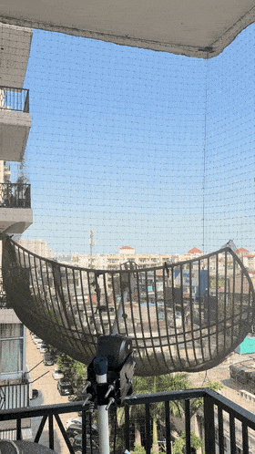

# DiSEqC dish rotator



An ESP32 turns a cheap DiSEqC 1.2 satellite dish motor into a WiFi controlled
azimuth rotator for a small radio telescope dish. Four passive parts, no driver
IC, no set top box. Built for a 1 m grid dish used for hydrogen line observing.

Ayushman Tripathi, https://radioastronomy.in. MIT licensed.

## How it works

The motor takes power and commands over one coax: 12 to 18 V DC plus a 22 kHz
tone burst carrying the command bytes. Two inductors feed the DC in, and a
resistor and capacitor couple the tone straight from a GPIO pin. The ESP32
builds the DiSEqC frames and serves a web page, an HTTP API and a serial
console.


```
Supply +  --- L1 --- L2 ---+--- coax centre --- motor REC port
                           |
GPIO 25 --- 100R --- 1uF --+

Supply -, coax shield, ESP32 GND tied together
```

| Part | Value |
|---|---|
| Motor | any DiSEqC 1.2 H-H motor (Hantech HD120 here) |
| MCU | ESP32 dev board, WROOM-32 |
| L1, L2 | 330 uH toroidal, 5 A |
| C | 1 uF 250 V film |
| R | 100 ohm |
| Supply | 12 to 18 V DC, 1 A. 15 to 18 V moves the dish better under load |

## Flashing

Copy `firmware/diseqc_rotator/secrets.example.h` to `secrets.h` and fill in
WiFi and an OTA password, then:

```
arduino-cli core install esp32:esp32
arduino-cli compile --fqbn esp32:esp32:esp32 firmware/diseqc_rotator
arduino-cli upload -p /dev/ttyUSB0 --fqbn esp32:esp32:esp32 firmware/diseqc_rotator
```

Later updates go over WiFi:
`espota.py -i <ip> -p 3232 --auth=<ota-password> -f diseqc_rotator.ino.bin`

## Using it

Open `http://<ip>/`. The dish drawing turns to the current pointing, a dashed
outline marks the target. Slider, jog, halt, calibration.

```
/goto?deg=30       go to +30 (east), negative for west, clamped to +-75
/gotoaz?az=318     go to a true azimuth, after calibration
/east?steps=5      jog, 1 to 128 steps, 0 runs until /halt
/west?steps=5
/halt
/status            JSON: pos, moving, az, target, last, uptime, ip, rssi
/setpos?deg=-12.5  correct the position estimate, sends nothing to the motor
/cal?aznow=318     the dish points at true azimuth 318 right now
/cal?speed=1.9     motor speed in deg/s (time a goto from 0 to 60)
/cal?step=0.1      degrees per jog step
/cal?dir=-1        if true azimuth shrinks when the motor angle grows
/raw?cmd=E0316A00  send any DiSEqC frame
```

Serial at 115200: `e 5`, `w 5`, `h`, `g 30`, `s` store ref, `z` goto ref,
`p -12.5` set position, `r E0 31 60` raw, `t` test tone, `i` IP.

The motor sends nothing back, so the angle shown is dead reckoning from the
commands sent and the motor speed, kept in flash across reboots. If it drifts,
read the scale on the motor and `/setpos`. Bad arguments return 400 and never
move the motor. There is no login, keep it on a network you trust.

## DiSEqC 1.2 frames

All start `E0 31`. `60` halt. `68 nn` / `69 nn` drive east / west, `nn` = 0
run, `0x80..0xFF` = 256-nn steps. `6A nn` store, `6B nn` goto stored.
`6E aa bb` goto angle: `aa` = `0xE0|hi` east or `0xD0|hi` west, angle*16 =
`(aa&0x0F)<<8 | bb`. Bits: 22 kHz tone, 0 = 1.0 ms on 0.5 off, 1 = 0.5 on 1.0
off, odd parity per byte.

## Next

Elevation with a linear actuator, a BNO055 on the dish for real az/el feedback,
a rotctld bridge for gpredict and Hamlib.

If your motor ignores commands, check the resistor value first. A kilohm part
where the 100 ohm belonged cost me an evening.
